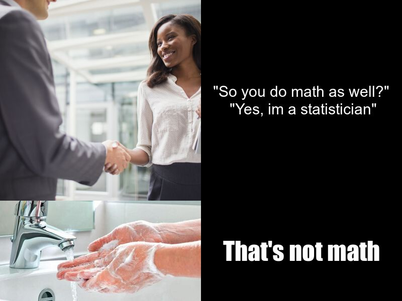

# My Statistics meme! 
## Made by kzha298(for stats220)

My three main inspiration for making this meme are:
- as a stats major i know a lots of math majors that dislike stats!!!
- and many of math major think stats are a lot easier!!(*however im not supporting this argument*) 
- I think the combination of handshake & handwash is really funny! So i used this idea
### Here's the Meme!




The R Package that i used is [{magick}](https://cran.r-project.org/web/packages/magick/vignettes/intro.html).
And the following are my code to make this Meme, feel free to copy and paste!

```r
#reading two pictures from internet

handshake <- image_read(path = 'https://www.verywellmind.com/thmb/0ZUxcaqPRokMIzKRi3Wh0Z-BDdQ=/2692x2692/smart/filters:no_upscale()/business-people-shaking-hands-outside-of-office-building-521813417-5954fdc33df78cdc2970d5ac.jpg')%>%
  image_scale(400)

handwash <- image_read(path = 'https://images.newindianexpress.com/uploads/user/imagelibrary/2020/4/8/w900X450/handwashing_.jpg?w=400&dpr=2.6')%>%
  image_scale(400)

#first column vector for our meme
col_1 <- image_append(c(handshake, handwash), stack = TRUE)

# creating two images with text for our meme
box.1 <- image_blank(height = 400, width = 400, color = 'black')%>%
  image_annotate(text = '\"So you do math as well?\"\n \"Yes, im a statistician\"',
                 size = 30, 
                 color = 'white', 
                 gravity = 'center')

box.2 <- image_blank(height = 200, width = 400, color = 'black')%>%
  image_annotate(text = 'That\'s not math', 
                 size = 50, color = 'white',
                 gravity = 'center', 
                 font = 'impact')

# second column for our meme and the combination into our final image
col_2 <- image_append(c(box.1, box.2), stack = TRUE)
my_meme <- image_append(c(col_1, col_2), stack = FALSE)
image_write(my_meme, 'my_Meme.png')

```
